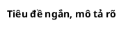
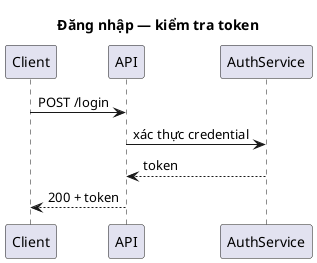

# Luật output PlantUML

## Output renderable

Trả nguồn PlantUML hoàn chỉnh trong một khối code, mỗi diagram một khối:



Với cú pháp không-UML dùng start tag chuyên biệt, dùng đúng cặp mở/đóng: `@startjson`/`@endjson`,
`@startyaml`, `@startmindmap`, `@startgantt`, `@startsalt`, `@startwbs`…

Ví dụ sequence diagram tối giản (đúng luật: title ngắn, ít notation, nhãn theo domain):



## Đặt tên file khi lưu (protected path)

`docs/` được bảo vệ — chỉ ghi sau khi người dùng **xác nhận**.

- Path mặc định: `docs/diagram/<loại>/<tên>_<yyyyMMdd_HHmm>.puml`.
- `<loại>` = tên loại diagram đã chọn (sequence, component, er…).
- `<tên>` = kebab-case (hoặc snake_case) từ tên người dùng đưa; mặc định kebab-case.
- Thời gian `yyyyMMdd_HHmm` theo giờ địa phương (vd `Asia/Saigon`).
- Extension `.puml` cho nguồn PlantUML trừ khi người dùng yêu cầu khác.

Trước khi ghi, nêu mẫu xác nhận:

```text
Đề xuất ghi file:
- Path: docs/diagram/<loại>/<tên>_<yyyyMMdd_HHmm>.puml
- Mục đích: lưu nguồn diagram PlantUML
- Tóm tắt: loại diagram, phạm vi, participant/entity chính

Xác nhận? (yes/no)
```

Chỉ ghi sau khi có **xác nhận rõ ràng**.

## Style

- Tên ngắn, ổn định; nhãn theo **ngôn ngữ domain** của người dùng.
- Ưu tiên **đọc được** hơn chi tiết vét cạn; dùng `title` cho ngữ cảnh.
- `skinparam` / style block tiết chế; tránh trang trí trừ khi người dùng cần bản trình bày.
- KHÔNG đưa secret / token / credential / hostname thật vào diagram trừ khi người dùng cung cấp để làm tài liệu.

## Quy tắc [giả định]

- Đánh dấu **[giả định]** cho system/actor/state/quan hệ được suy ra.
- KHÔNG bịa API/bảng/state/hạ tầng mà không đánh dấu.
- Nếu cú pháp PlantUML của một loại hiếm còn chưa chắc → chọn notation đơn giản được hỗ trợ và **nêu đánh đổi**.

## Hướng dẫn render (khi người dùng hỏi cách xem)

- PlantUML online server: dán nguồn vào server/plugin editor hỗ trợ.
- Local CLI: `java -jar plantuml.jar diagram.puml`.
- Xuất SVG: `java -jar plantuml.jar -tsvg diagram.puml`.

KHÔNG khẳng định diagram đã render thành công trừ khi thật sự chạy lệnh render.

## Checklist review trước khi trả

- Nguồn bắt đầu/kết thúc bằng directive hợp lệ; mọi block đã đóng.
- Loại diagram khớp mục tiêu người dùng; bỏ chi tiết triển khai không liên quan.
- Nhãn theo domain; phần suy đoán đã đánh dấu [giả định].
- Giải thích tiếng Việt ngắn gọn, hành động được.
